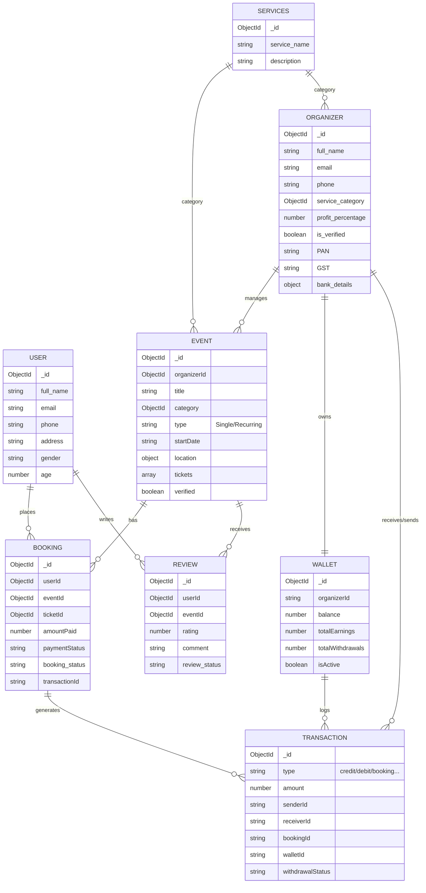

# Hobi App - Backend Architecture

## Database Schema (NoSQL - MongoDB)

Although Hobi uses MongoDB (NoSQL), the data architecture is highly structured with clear relational mappings. Using NoSQL allows us to handle dynamic attributes and high-read volumes efficiently without the overhead of heavy joins.

### Entity Relationship Diagram

### Architectural Rationale

#### 1. Performance (Single Document Fetch)
Storing complex objects like `Event` tickets, inclusions, and location as nested arrays/objects within a single document allows us to fetch everything needed for a UI view in **one query**. This eliminates the 4-5 table joins that would be required in a SQL database, significantly reducing database latency.

#### 2. Schema Flexibility
Our entities (especially Events and Organizers) have varying metadata—different types of licenses, dynamic documentation, and per-activity specific fields. MongoDB’s NoSQL nature handles these variations natively without the need for complex 'Entity-Attribute-Value' (EAV) patterns or sparse columns.

#### 3. Data Integrity with Mongoose
We enforce data integrity and validation through **Mongoose Schemas**. Every relationship (referenced via `ObjectIDs`) is validated at the application level, giving us the reliability of a relational database with the horizontal scaling capabilities of NoSQL.

#### 4. Developer Velocity
The entire stack uses TypeScript. MongoDB’s BSON format aligns perfectly with our front-end and back-end interface requirements, removing the 'Object-Relational Mapping' tax and speeding up feature development.
